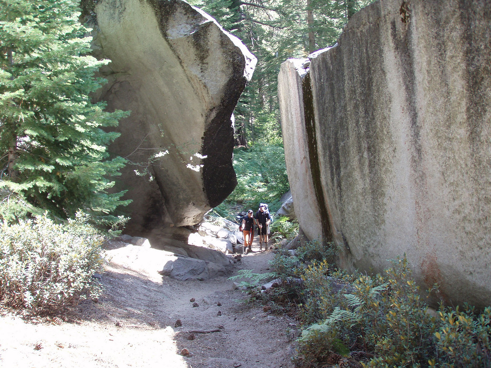

```{r setup, include=FALSE}
knitr::opts_chunk$set(echo = TRUE)
knitr::opts_chunk$set(screenshot.force = FALSE)
```

This is a test of a leaflet map made in R, and ported over via jekyll to this post.
It's a fairly simple map of the Pacific Crest Trail, which I hope to hike in it's entirety one day.
Maybe not all at once, but certainly in segments. It's a truly amazing trail, I've done chunks of it, including the John Muir Trail and a decent stretch south of Ebbetts Pass.




```{r, echo=F, warning=F, message=F}

library(leaflet)
library(rgdal)
library(maps)

# Fetch the route of the PCT and convert it into a SpatialLine object
#url <- "http://hiking.waymarkedtrails.org/en/routebrowser/1225378/gpx"
#download.file(url, destfile = ".././data/gis/pct.gpx")
pct <- readOGR("data/pct.gpx", layer = "tracks",verbose = FALSE)

# Import list with shapefiles of the three states the PCT is crossing
mapStates <- map("state", fill = TRUE,
                 plot = FALSE,
                 region = c('california', 'oregon', 'washington:main'))

# quick demo map
your.map <- leaflet(pct) %>%
  
  # Add layer
  addTiles(urlTemplate = "http://{s}.basemaps.cartocdn.com/light_all/{z}/{x}/{y}.png") %>%
  addTiles(group = "OSM") %>% 
  addPolylines(color="red", popup="PCT")  %>%
  addMarkers(-116.4697, 32.60758, popup = "Campo") %>%
  addMarkers(-120.7816, 49.06465, popup = "Manning Park, Canada") %>%
  addPolygons(data=mapStates, fillColor = heat.colors(3, alpha = NULL), stroke = FALSE) %>%
  
  # Add legend
  addLegend(position = 'topright', colors = "red", labels = "PCT", opacity = 0.4,
            title = 'Legend')

your.map  # to embed separately, use an Rmd and embed then render to html

```

