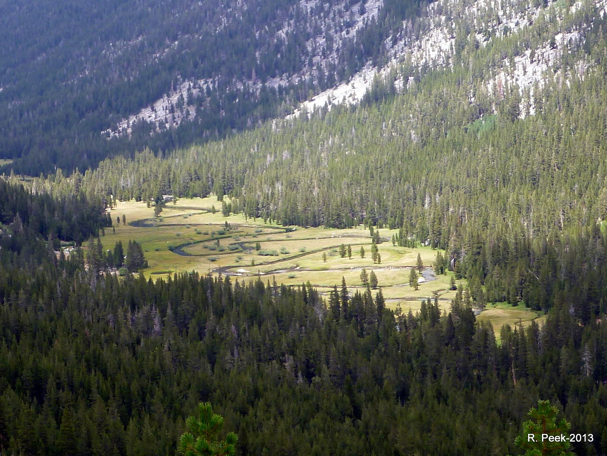

## Making Animations!

Last post I discussed and demonstrated how you can make a pretty nice map using **R**. Building on that, and some work I've been doing for an upcoming conference presentation, I spent some time figuring out how to take some of those really nice maps, plotted through time, and turn them into animated gifs. These are great for presentations, web display, etc, and really pretty easy to build in a **`ggplot`** framework. I'll show two different methods, one using the *`purrr`* package, and the other using system calls to the really nice **ImageMagick** program, which is open source and cross-platform compatible.

The only downside I'm finding (at least building them using these `ggmap` base .png's) is that the final `.gif` seems to end up as a fairly large file size (for a `.gif`).  These animations below were 15-16MB in size. I know I've made compact gifs with these same sets of *.pngs* before but can't remember exactly how I did it. Whe I figure out a solution, I'll update this post. Let's get started!

### What You'll Need

For both methods, you'll need to install [ImageMagick](http://www.imagemagick.org/script/index.php). With that installed you can either call directly from your console/system or from R. I'll show both methods. On the R side, I'm using quite a few R packages here, so I've tried to add comments about what each one is. 

```{r load libs, echo=T, eval=F, warning=FALSE}

library(viridis) # nice color palette
library(ggplot2) # plotting
library(ggmap) # ggplot functionality for maps
library(dplyr) # use for fixing up data
library(readr) # reading in data/csv
library(RColorBrewer) # for color palettes
library(purrr) # for mapping over a function
library(magick) # this is call to animate/read pngs

```

### Background

For this example, I'm using Google Earth Engine LANDSAT derived data on a subset of meadows in the Sierra Nevada. There are many metrics and data that you can pull, but for this example I'm going to show NDWI (Normalized Differenced Wetness Index), which is basically **vegetation water content**. This metric uses a combination of the Near-Infrared (which gives information about leaf dry matter and internal structure) and Short Wave Infrared (which reflects changes in vegetation water content and the spongy mesophyll structure in canopies) bands from the LANDSAT satellite. I've aggregated this data to a monthly maximum from a composite of 8 day means at 30-m resolution. If you want to read more about this metric, check out this [helpful page](http://edo.jrc.ec.europa.eu/documents/factsheets/factsheet_ndwi.pdf).



I've compiled data from **22 meadows over 34 years**, using the maximum mean value in August as the data I'll be plotting. The idea being it would be nice to show which meadows are more sensitive to fluctuations in seasonal precipitation (how much precipitation or snow California gets per [Water Year](http://cdec.water.ca.gov/cgi-progs/products/PLOT_ESI.pdf) (*Oct 1 - Sep 30*). This is to help visualize which meadows are more driven by local precipitation (snow) than by groundwater, which is something many are actively trying to figure out.

### Load the NDWI Data

The data used for this post is available in my git repo (`data/ndvi_ndwi_for_mdws_maps.rda`) if you'd like to use it. I'm going to just be using the NDWI values and the latitude and longitude values.

```{r load data, eval=F, echo=T}

# Get the Data
load("../data/ndvi_ndwi_for_mdws_maps.rda")

head(ndwi.df)

```

### Load the Map Background

Now set up the plot using `ggmap` and set a scale or breaks that can be used in the legend with the color bar. This is the background that the plot will use for the animation. It can be easily changed or tweaked.

```{r set ggmap, eval=F, echo=T}

## Set the Scale
breaks<-(c(0.0,0.1,0.2,0.3,0.4,0.5,0.6,0.7,0.8,0.9)) # for color scale

# Get the basemap
ca <- get_map(
  #location='california',
  c(lon=-120,lat=38.7),
  zoom=7,crop=T,
  scale="auto",color="bw",source="google",
  maptype="terrain") # can change to terrain

gg <- ggmap(ca, extent='panel',padding=0) 

```

### Set up `ggplot` function

Once the ggmap is loaded, we can set up a `ggplot2` function to plot each year, and loop through a sequence of years, creating an individual *png* for each year. I've added a lot of customizations to this ggplot, in particular shifting the legend inside the plot, and adding a facet label so its possible to see which year is flashing by during the animation. I'm also using the very useful and beatiful `viridis` color palette. Obviously you may want to change the path to the location you'd like all these plots to be saved, but beyond that, this function should work.

```{r ggplot function, eval=F, echo=T}

ndwi_map <- function(Yr){
  
  gg + geom_point(data=ndwi.df[ndwi.df$WY==Yr,], 
                        aes(x=LONG_DD, y=LAT_DD, fill=mean),
                  show.legend=F, pch=21, size=4.8, color="gray30")+ 
    theme_bw() + ylab("Latitude") + xlab("Longitude") +
    theme(axis.text.x = element_text(angle = 60, vjust=0.15, size=8),
          legend.position=c(1,1),legend.justification=c(1,1),
          legend.direction="vertical",legend.text=element_text(size=8),
          legend.title=element_text(size=8, face="bold"),
          legend.box="horizontal", panel.background = element_blank(),
          legend.box.just = c("top"), 
          legend.background = element_rect(fill=alpha('white', 0.6), colour = "gray30")) +
    scale_fill_viridis(name="NDVI (Aug)", limits=range(breaks), 
                        breaks=breaks, option = "D", direction = -1)+
    facet_wrap(~WY, ncol = 1)
    print(paste0("saving plot ", Yr))
    ggsave(filename = paste0("./fig_output/ndwi/hgm_ndwi_",Yr,".png"),
           width = 8,height=8,dpi = 150)
}

```

## Make PNGs (with `purrr`)

Ok so we have a function to create our stills, let's use the `map` function in the `purrr` library to map a sequence of years to the function, essentially looping through everything, but using an *apply* framework instead of the loop framework.

```{r map with purrr, eval=F, echo=T}

# Step 1: Make Plots For Year Range 
seq(from = 1984, to=2015, by=1) %>% 
  map_df(ndwi_map)

```

Ok, so hopefully the above function ran and you have a folder of stills somewhere. Nearly there! 

## Animate with `magick`/`ImageMagick`

The final step is to read in the path and png for each of the figures we just created, and create a short animation. Thankfully there's some nice functions already written that do this for us. Using the `purrr` framework, we can read in all the pngs of interest, and using the `magick` package, we can write into an animated gif using the `ImageMagick` program. We can specify the speed or number of loops in the `image_animations` function quite easily. Read documentation on these functions for more details.

```{r read pngs animate, eval=F, echo=T}

# Step 2: List those Plots, Read them in, and then make animation
list.files(path = "./fig_output/ndwi/", pattern = "*.png", full.names = T) %>% 
  map(image_read) %>% # reads each path file
  image_join() %>% # joins image
  image_animate(fps=2) %>% # animates, can opt for number of loops
  image_write("ndwi_aug_hgm.gif") # write to current dir

```

### Animated GIF!

Hopefully this works...we should now have a fairly large but lovely animated map of the NDWI from 1984-2015.


## Animate with A System Call to ImageMagick

A secondary option is to just call ImageMagick directly and make revisions edits in that pipeline. There is certainly immense control in using the command line option. Here I'm showing commands compatible with a Mac Book Pro, but they are likely slightly different with a PC based machine.

```{r animation w systemImageMagick, echo=T, eval=F}

## Using ImageMagick: Set working dir first to images
system(command= "convert ./fig_output/cdec/hgm_snowcdec_v2* -delay 100 -loop 0 cdec_snow_IM.gif")
# play with -delay as necessary, this is much faster than the fps in "magick"

# To Resize Use
system(command= "convert -size 1100x850 cdec_snow.gif -resize 800x600 cdec_snow_small.gif")

## OR
system(command= "convert cdec_snow.gif -resize 50% cdec_snow_small.gif")

## TO Slow down use existing Gif

system(command = "convert -delay 40 cdec_snow.gif cdec_snow.gif")

```

## Hopeful this was useful!

Thanks for reading...hopefully there are some useful tidbits in here for use. 
