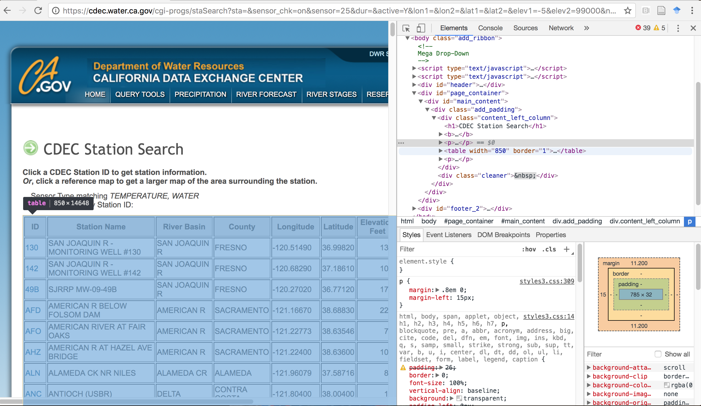

```{r setup, include=FALSE}
knitr::opts_chunk$set(echo = TRUE, warning=FALSE, message=FALSE)
knitr::opts_knit$set(root.dir = normalizePath("../"))

```

# Part I: Calculating Distance Matrices for Nearest Points with `sf`, `SearchTrees`, & `Imap`

  As usual I wanted to post more regularly and it hasn't happened. However, I've been using the `sf` package a bunch lately, and I wanted to provide a series of posts that highlight some of the ways I've used it. Overall I've been impressed, it's fast, does nearly everything I need, and it even plays with `ggplot2`<sup>1</sup>. 

  Hopefully the next set of posts will show a few ways you can use these tools, and a few random tricks for data mining and working with spatial data. 

  One of the more difficult and interesting tasks I've had to sort out recently is how to snap/attribute the nearest stream segment or USGS flow gage to a set of study sites in order to calculate distances between sites. So, more plainly, how to identify the nearest neighbor for one set of points to another. Later, I'll show how to snap a set of points to a river network and calculate distances along that line network.

### Load the Packages

I recognize this part isn't always trivial...especially if you are working on a Linux system. I'm not going to go into too much detail, but I know getting `sf` and `tidverse` installed does require a number of dependencies, so if you run into trouble, try some googling, or drop me a note.

The main packages I'm going to use in this post:

```{r packages}

# load libraries
suppressMessages({
  library(tidyverse);
  library(sf);
  library(rvest);
  library(SearchTrees);
  library(Imap)
})
```

# Getting Data to Calculate Distances Matrix

For my purposes, I'm often interested in associating a given stream reach or sample site with a USGS Gage in order to extract flow data. See the section on [**Snapping to Nearest Points**](#snaptopoints). A future post will show how to calculate river or network distances between sets of points, as well as how to download stream/river data. For now, let's focus on how to find the nearest point and calculate pairwise distances.

<!--
## Get Some GW Site Localities

For this exercise, I'm using some USGS groundwater (GW) monitoring locations from the National Water Information System. I just downloaded them all to csv via this [mapping interface](https://maps.waterdata.usgs.gov/mapper/nwisquery.html?URL=https://waterdata.usgs.gov/ca/nwis/current?type=gw&group_key=county_cd&format=sitefile_output&sitefile_output_format=xml&column_name=agency_cd&column_name=site_no&column_name=station_nm&column_name=site_tp_cd&column_name=dec_lat_va&column_name=dec_long_va&column_name=agency_use_cd) (*click on Export Sites*, export to csv). First we need to read this data in and format it for use in our spatial analysis.

```{r load_gw_data}

# read in data:
gw_locs <- read_csv("data/NWISMapperExport.csv")
dim(gw_locs)

```

Looks like we have 181 points to work with. Let's format this data so it's a bit simpler (i.e., rename a few columns).

```{r rename_gw_cols}

gw_locs <- gw_locs %>% rename(lon = SiteLongitude, lat = SiteLatitude)

```
-->

## Scrape Web for CDEC Water Temperature Localities

Just for fun, I'm going to show how to scrape some web data (a table on a website) using the `rvest` package. This is a fairly painless process, though a little tricky at first.

CDEC has a bunch of stations, and it can be hard to find the one you need/want. This [webpage](https://cdec.water.ca.gov/cgi-progs/staSearch) provides a way to filter things down to what you want. For this example, let's filter to **active** CDEC stations that collect water temperature data (**sensor=25**), and get a table of sites and locations.

I've linked to the CDEC page with the table [here](https://cdec.water.ca.gov/cgi-progs/staSearch?sta=&sensor_chk=on&sensor=25&dur=&active=Y&lon1=&lon2=&lat1=&lat2=&elev1=-5&elev2=99000&nearby=&basin=ALAMEDA+CR&hydro=CENTRAL+COAST&county=ALAMEDA&operator=%2B&display=sta), go take a look so you know what the data looks like. 

### Identify the Table & get the `Xpath`

To pull that data in as a dataframe, there's a few small intermediate steps that will help us grab the data. I'm going to show this using Chrome, but other browsers likely have similar capabilities. 

 1. Once you have the [webpage](https://cdec.water.ca.gov/cgi-progs/staSearch?sta=&sensor_chk=on&sensor=25&dur=&active=Y&lon1=&lon2=&lat1=&lat2=&elev1=-5&elev2=99000&nearby=&basin=ALAMEDA+CR&hydro=CENTRAL+COAST&county=ALAMEDA&operator=%2B&display=sta) up, if you right click anywhere on the page and select **`Inspect`**, you'll see a window with all the crazy underbits of the webpage. 
 2. If you click inside the upper right hand side box, and hover your mouse around in that same box, you'll see a corresponding highlighted area on the left hand side (the actual webpage). Do that until you find the line that highlights the exact table you are interested in, as shown in this screen shot below. 



In this case, you should have clicked on a line that says something like:

```<table width="850" border="1">...</table> == $0```

 3. Right click on that line in the upper right hand box, and select **Copy** and then **Copy XPath**, you'll have completed all the tricky parts of this section! On to getting some R code written.

### Now Scrape/Download the Data

Let's load up the `rvest` package, set our url, and then *copy that Xpath* into the `xpath=` argument. This basically helps the computer parse out the webpage so that you only end up with the good bits inside that specific table, and nothing else.

```{r htmlgrab, echo=T, eval=T}
library(rvest)

url <- "https://cdec.water.ca.gov/cgi-progs/staSearch?sta=&sensor_chk=on&sensor=25&dur=&active=Y&lon1=&lon2=&lat1=&lat2=&elev1=-5&elev2=99000&nearby=&basin=ALAMEDA+CR&hydro=CENTRAL+COAST&county=ALAMEDA&operator=%2B&display=sta"

df <- url %>%
  read_html() %>% 
  html_nodes(xpath='//*[@id="main_content"]/div/div[1]/table') %>% # inspect and xpath with chrome
  html_table()
df_locs <- df[[1]] # reads in as a list, so we are just eliminating the list and making this a dataframe

head(df_locs)

```

### Clean and Make Spatial (with `sf`)

Ok! We now have a dataframe of CDEC sites that collect temperature data. Let's take that data and do a little revising, and make our data a `sf` *spatial* object:

```{r fixhtml_df, echo=T, eval=T}

# names
names(df_locs)

# rename cols:
df_locs <- df_locs %>% rename(station="Station Name", river_basin="River Basin", 
                              lon=Longitude, lat=Latitude, elev_ft=`Elevation Feet`) %>%
  select(-Map)

# remove and filter out the weird UNIX code "&nbsp"
df_locs$elev_ft <- as.numeric(gsub(pattern = "&nbsp", replacement = "", df_locs$elev_ft)) 

# make CDEC data sf: 
df_locs <- st_as_sf(df_locs, 
                    coords = c("lon", "lat"), # for point data
                    remove = F, # don't remove these lat/lon cols from df
                    crs = 4326) # add projection (this is WGS84)

summary(df_locs)

```

Great! First thing you'll notice is that `sf` reads this in as a simple dataframe, and has a `list-column` on the end called *`geometry`* which is where the spatial data lives. Now we have data ready to go.

## Get USGS Gage Locations

Next step, let's get another set of points to compare/snap our data to, and we'll use the USGS Gage dataset. These data are available via a *Gages II* dataset (download the [shapefile here](https://water.usgs.gov/GIS/dsdl/gagesII_9322_point_shapefile.zip)). Here we can read this shapefile in (once unzipped) with the `sf` package. Note, these are gages for the entire US.

```{r load_gage_data, eval=F, echo=T}

library(sf)
gages <- st_read("data/gagesII_9322_sept30_2011.shp", quiet = F)

```

### Insider `sf`/`shapefile` Trick

Figured out this recently, you can keep your shapefile zipped! The great thing about this is it saves space and just the sheer number of files you have to deal with. You can take it or leave it, but here's how it works. You essentially keep the shapefiles zipped, but unzip and read them in temporarily, then remove the temporary unzipped files, but keep the file in your R environment for analysis.

```{r read_zipped_shapes, eval=T, echo=T}

library(sf)

# read in zipped
gages <- st_read(unzip("data/gagesII_9322_sept30_2011.zip"), quiet = F)

# then remove raw files since file is added in memory
file.remove(list.files(pattern = "gagesII_9322_sept30_2011*",recursive = F))

```

There are 9322 records, and this data already has a projection (`aea`) and is in NAD83, so we should probably reproject into something different for the next few sections. Let's also filter our data to only sites in California. The cool thing is we can just use normal dplyr/subsetting functions as we would on a normal dataframe.

```{r filter_gages, echo=T, eval=T}

# filter to only active gages in CA
gages_ca <- gages %>% filter(ACTIVE09=="yes", STATE=="CA") %>% 
  st_transform(crs = 4326)

```

Great, only **532** gages now...that should be enough to cover our CDEC temperature locations. 

## MAPS: Make a Leaflet Map of Our Point Data

So now we have two layers to work with, let's make a quick leaflet map so we can get a sense of what we have. The blue dots are USGS data, and orange circles are the CDEC temperature data.

```{r leaflet_map, eval=T, echo=T}

#quick plot:
suppressPackageStartupMessages({
  library(leaflet)
  library(htmltools)
})

# MAP
aMAP<-leaflet() %>% #width = "100%", height="100%"
  addTiles() %>% 
  addProviderTiles("Esri.WorldTopoMap", group = "Topo") %>%
  addProviderTiles("Esri.WorldImagery", group = "ESRI Aerial") %>%

  # add scale bar
  addMeasure(position = "topright",
             primaryLengthUnit = "meters",
             primaryAreaUnit = "sqmeters",
             activeColor = "#3D535D",
             completedColor = "#7D4479") %>%
 
  # all CA gages
  addCircleMarkers(data=gages_ca, group="USGS gages CA",
                   stroke=TRUE, weight=0.3, radius=4,
                   fillOpacity = 0.7,
                   fillColor = "blue",
                   popup=paste0("USGS Site: ", gages_ca$STANAME, 
                                "<br>","SiteNo: ", gages_ca$STAID,
                                "<br>", "Ecoregion: ", gages_ca$AGGECOREGI,
                                "<br>", "Drainage Area (sqkm): ", gages_ca$DRAIN_SQKM)) %>% 
                   #clusterOptions = markerClusterOptions(),
                   #clusterId = "gagesCluster") %>%
  
  # add samples
  addCircleMarkers(data=df_locs, group="CDEC Stream Temp Localities",
                   opacity = 0.8, 
                   popup=paste0("CDEC Site: ", df_locs$ID, "<br>",
                                "Station Name: ", df_locs$station, "<br>",
                                "Elev_ft: ", df_locs$elev_ft, "<br>",
                                "Operator: ",df_locs$Operator),
                   weight=0.6,radius=10, stroke=TRUE,
                   fillColor = "orange") %>%
  #hideGroup("GW Localities") %>% 
  
  addLayersControl(
    baseGroups = c("Topo","ESRI Aerial"),
    overlayGroups = c("CDEC Stream Temp Localities", "USGS gages CA"),
    options = layersControlOptions(collapsed = T)) %>% 
  
  addLegend(position = "bottomright", labels=c("USGS Flow", "CDEC Water Temp"),
            colors=c("blue", "orange"), opacity=1)

aMAP

```

# Snap CDEC Sites to Nearest USGS Gages {#snaptopoints}

Now we can calculate the nearest USGS gage to each CDEC water temperature location. There are a few options to do this, but the two primary packages I found useful for this purpose were:

 - `SearchTrees`: uses  *k nearest-neighbor lookup*
 - `Imap`: which uses a `gdist` function 

## Nearest Points Using `knn lookup`

This code determines the nearest-n points to an existing set of points. Here, we can use it to find/assign the nearest USGS gage to our existing sampling sites. First we load the `SearchTrees` package, then calculate indices based based on spatial locations, and then get the 2 nearest locations to each point (you can select as many nearest as you need). Then make a simple plot using the base plotting and `sf`. The plot shows the CDEC temperature gage (orange square), and the two nearest USGS gages in matching colored circles.

```{r knn_trees, echo=T, eval=T}

library(SearchTrees)

# filter df_locs to just a few counties for nicer visualization:
df_locs <- df_locs %>% filter(County %in% c("EL DORADO", "PLACER", "SACRAMENTO", "NEVADA"))

## Find indices of the two nearest points in A to each of the points in B
tree <- createTree(st_coordinates(gages_ca))
inds <- knnLookup(tree, newdat=st_coordinates(df_locs), k=2) # can be 2 or more

## Show that it worked
plot(st_coordinates(df_locs), # randomly selected pts
       #bg=c("orange","maroon","purple","yellow", "green"), 
       pch=22, col="orange", cex=1.5)
points(st_coordinates(gages_ca), pch=1, cex=0.8)

## Plot two nearest neigbors
points(df_locs$lon[3], df_locs$lat[3], pch=21, col="forestgreen", cex=3)
points(st_coordinates(gages_ca)[inds[3,],], pch=16, col=adjustcolor("forestgreen", alpha=0.9), cex=1.5)

points(df_locs$lon[11], df_locs$lat[11], pch=21, col="blue", cex=3)
points(st_coordinates(gages_ca)[inds[11,],], pch=16, col=adjustcolor("blue", alpha=0.7), cex=1.5)

points(df_locs$lon[4], df_locs$lat[4], pch=21, col="purple", cex=3)
points(st_coordinates(gages_ca)[inds[4,],], pch=16, col=adjustcolor("purple", alpha=0.7), cex=1.5)

points(df_locs$lon[6], df_locs$lat[6], pch=21, col="maroon", cex=3)
points(st_coordinates(gages_ca)[inds[6,],], pch=16, col=adjustcolor("maroon", alpha=0.7), cex=1.5)
legend(legend=c("CDEC","USGS"), "bottomright", col=c("orange", "black"), pch=c(22, 1), pt.cex=c(1.5, 0.8))

```

### Make Dataframe Joining to Nearest Points

Now we have the data and an index of the nearest point to every other point (or nearest 2), we can rebuild a dataframe for future use. This just lists the nearest **2** USGS gages to the CDEC temperature gages, along with a few other important pieces of info.

```{r add_dist_data}

inds_df <- tibble("usgs01"=inds[,1], "usgs02"=inds[,2],
                  "usgs01_ID"=gages_ca$STAID[inds[,1]],
                  "usgs02_ID"=gages_ca$STAID[inds[,2]],
                  "cdec_id"=df_locs$ID,
                  "cdec_sta"=df_locs$station,
                  "cdec_lon"=df_locs$lon,
                  "cdec_lat"=df_locs$lat)

head(inds_df)

```

## Calculate Distance Matrix Using `Imap`

Well, that was awesome the first time it worked for me. One other thing that can be helpful is making a matrix of the distances (so all the possible pairwise comparisons between sites. This example is using the geodesic or euclidean distances (**not river distances**), but could be useful for comparing testing (*Euclidean vs. river networks distance*). Also check out [`geosphere`](https://cran.r-project.org/web/packages/geosphere/vignettes/geosphere.pdf) package for additional functions of `daylength`, `dist2lines`, and random sampling of lat/longs. 

Here we load two different functions, which I did not write (I need to track down reference where I found these!), 

 - `ReplaceLowerOrUpperTriangle`: Basically helps fill the upper or lower half of the distance matrix since they are exact opposites
 - `GeoDistanceInMetresMatrix`: This helps calculate the matrix of distances between each pairwise comparison (each set of sites).
 
To use these, we:

 - load the matrix of CDEC temperatures (specifying only the ID and `lat`/`long` columns), 
 - Run the function
 - Plot these data and add row/col names, 
 - add the actual value in the grid, 
 - add a title.

```{r calc_dist_matrix, eval=T, echo=T}

library(Imap)

# make function
ReplaceLowerOrUpperTriangle <- function(m, triangle.to.replace){
  # If triangle.to.replace="lower", replaces the lower triangle of a square matrix with its upper triangle.
  # If triangle.to.replace="upper", replaces the upper triangle of a square matrix with its lower triangle.
  
  if (nrow(m) != ncol(m)) stop("Supplied matrix must be square.")
  if      (tolower(triangle.to.replace) == "lower") tri <- lower.tri(m)
  else if (tolower(triangle.to.replace) == "upper") tri <- upper.tri(m)
  else stop("triangle.to.replace must be set to 'lower' or 'upper'.")
  m[tri] <- t(m)[tri]
  return(m)
}

GeoDistanceInMetresMatrix <- function(df.geopoints){
  # Returns a matrix (M) of distances between geographic points.
  # M[i,j] = M[j,i] = Distance between (df.geopoints$lat[i], df.geopoints$lon[i]) and
  # (df.geopoints$lat[j], df.geopoints$lon[j]).
  # The row and column names are given by df.geopoints$name.
  
  GeoDistanceInMetres <- function(g1, g2){
    # Returns a vector of distances. (But if g1$index > g2$index, returns zero.)
    # The 1st value in the returned vector is the distance between g1[[1]] and g2[[1]].
    # The 2nd value in the returned vector is the distance between g1[[2]] and g2[[2]]. Etc.
    # Each g1[[x]] or g2[[x]] must be a list with named elements "index", "lat" and "lon".
    # E.g. g1 <- list(list("index"=1, "lat"=12.1, "lon"=10.1), list("index"=3, "lat"=12.1, "lon"=13.2))
    DistM <- function(g1, g2){
      require("Imap")
      return(ifelse(g1$index > g2$index, 0, gdist(lat.1=g1$lat, lon.1=g1$lon, lat.2=g2$lat, lon.2=g2$lon, units="m")))
    }
    return(mapply(DistM, g1, g2))
  }
  
  n.geopoints <- nrow(df.geopoints)
  
  # The index column is used to ensure we only do calculations for the upper triangle of points
  df.geopoints$index <- 1:n.geopoints
  
  # Create a list of lists
  list.geopoints <- by(df.geopoints[,c("index", "lat", "lon")], 1:n.geopoints, function(x){return(list(x))})
  
  # Get a matrix of distances (in metres)
  mat.distances <- ReplaceLowerOrUpperTriangle(outer(list.geopoints, list.geopoints, GeoDistanceInMetres), "lower")
  
  # Set the row and column names
  rownames(mat.distances) <- df.geopoints$Locality
  colnames(mat.distances) <- df.geopoints$Locality
  
  return(mat.distances)
}

# calc dist in km
distmatrix<-round(GeoDistanceInMetresMatrix(df_locs[,c(1,5:6)]) / 1000)
head(distmatrix)

# dist matrix in heatmap form
image(1:nrow(distmatrix), 1:ncol(distmatrix), distmatrix, axes = FALSE, 
      xlab="", ylab="", col = terrain.colors(100))
colnames(distmatrix)<-df_locs$SiteName
rownames(distmatrix)<-df_locs$SiteName
axis(1, 1:nrow(distmatrix), rownames(distmatrix), cex.axis = 0.7, las=3, family="Roboto Condensed")
axis(2, 1:nrow(distmatrix), colnames(distmatrix), cex.axis = 0.5, las=1, family="Roboto Condensed")
text(expand.grid(1:nrow(distmatrix), 1:ncol(distmatrix)), sprintf("%0.1f", distmatrix), cex=0.6, family="Roboto Condensed")
title("Euclidean Distance matrix (km) \n for All CDEC Water Temp Sites", cex.main=0.8, family="Roboto Condensed")
```

**VICTORY!!**

Yup....we did some stuff. Maybe it was helpful!


# Summary

Stay tuned for Part II next week, which will cover some more detailed ways to use `sf` to buffer, clip/crop, intersect as well as how to plot sf spatial data using the `ggplot2` framework.


[1] Getting `sf` and `ggplot2` can be quirky at times, but overall once you understand how to get the layers to work it's great.
