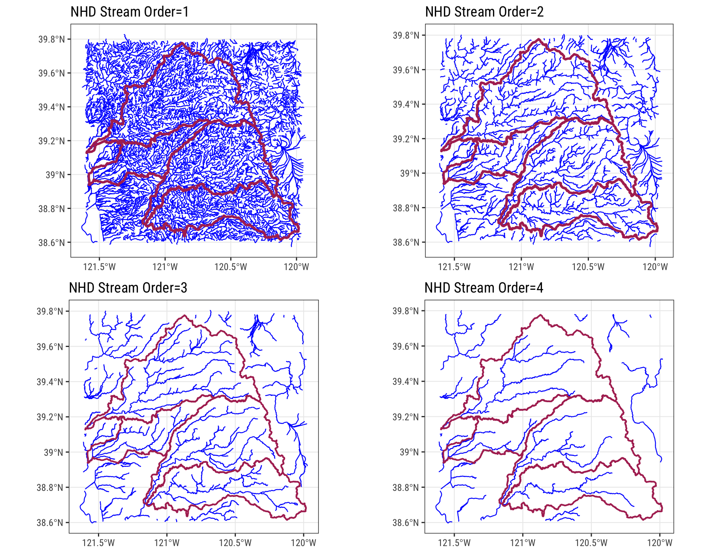

```{r setup, include=FALSE}
knitr::opts_chunk$set(echo = TRUE, warning=FALSE, message=FALSE)
knitr::opts_knit$set(root.dir = normalizePath("../"))

```

## Part II: Download NHD Flowline Data and Use `sf` Functions

  So last post ([Part I](https://ryanpeek.github.io/2017-10-24-mapping-with-sf-part-1/)), I showed how to calculate distance matrices and find out the nearest points between two sets of point data.
Now that we know how to identify the nearest neighbor for one set of points to another, let's look at how we can grab some line data (in this blogpost, I'm using river networks) and crop it based on our point data. I'll show how to go download a few different sets of river line data, how to buffer, and how to crop/intersect data based on other polygons or point data. The next post (Part III) will show how you can snap the spatial point data to the river network (line) data using the `riverdist` package, and calculate the river distance between sites (so along the river network).

## Load the Packages

The main packages I'm going to use in this post:

```{r packages}

# load libraries
suppressMessages({
  library(dplyr); # data munging and piping
  library(purrr); # for list functions
  library(ggplot2); # plotting
  library(ggrepel) # for labeling
  library(sf); # spatial simple features
  library(USAboundaries); # state/county data
  library(Imap); # nice mapping/color functions
  #library(geoknife); # USGS tool set (Next post)
  #library(dataRetrieval); # USGS tool set (next post)
  library(httr) # scraping webdata (to download flowlines)
})
```

Note, to plot `sf` objects with `ggplot`, you need to have the most recent version (>2.2.1). A quick and easy check you can add to your code is an `if` statement:

 > `if (utils::packageVersion("ggplot2") > "2.2.1"))`

# Download River Line Data

I'm going to demo two different sets of watershed/river data which are openly accessible, and I think represent very good data for these types of analyses.

 - **US:** If you work in the US, the *go-to* data is typically the [National Hydrography Dataset](https://nhd.usgs.gov/data.html). This dataset has myriad of different components, and is linked to the [USGS NWIS](https://waterdata.usgs.gov/nwis). These are really amazing data that are publically available, so I'll walk through just a few of the things you can do. 
 - **Global:** There's a cool dataset with global coverage which includes both stream and lakes called [HydroSHEDS](http://www.hydrosheds.org/). It's based on high-resolution elevation data obtained during Space shuttle flight as part of NASA's Shuttle Radar Topography Mission (SRTM). To access the data, you'll need to create a free account (just an email req'd), but once that's done you can download any piece of these data. I'll show the same example with these data as well, and provide a snippet folks can download if need be.

## Using NHD Data

There are many components of the NHD dataset, but thankfully folks over at [Office of Water Information at USGS](https://owi.usgs.gov/) have built some great [tools and code](https://owi.usgs.gov/datascience/) to work with NHD data. I'll show how to download the NHD River data at different scales, and how to crop it to an area of interest using another polygon, or a set of points. If you want to see a few cool posts that utilize the USGS tools and data, I definitely recommend checking out some of these:

 - [Assessing precipitation from Hurricane Harvey](https://owi.usgs.gov/vizlab/hurricane-harvey/) & [code](https://github.com/USGS-VIZLAB/hurricane-harvey).
 - [Visualizing the Hurricane Irma's water footprint](https://owi.usgs.gov/vizlab/hurricane-irma/) & [code](https://github.com/USGS-VIZLAB/hurricane-irma)

### Load the NHDFlowline Function

First we are going to load a few libraries and functions which are required to download the NHD data. This function is from the blogs linked above, and requires specification of `streamorder` and `mapRange`. Note the default downloads stream layers with a `stream order` = 1, so the finest scale possible (headwater streams are 1, and larger rivers are usually > 4--5). 

I'm not going to go into much detail on this function, but the original function comes from a gist by Laura DeCicco (see [here](https://gist.github.com/ldecicco-USGS/56262f3809f0807cb523d7105cb790a9)), and I modified it slightly to work with the `sf` package.

```{r getNHD_flowlines_function, eval=T, echo=T}

library(httr)

get_flowlines <- function(streamorder, mapRange){
  postURL <- "https://cida.usgs.gov/nwc/geoserver/nhdplus/ows"
  
  filterXML <- paste0('<?xml version="1.0"?>',
                '<wfs:GetFeature xmlns:wfs="http://www.opengis.net/wfs" xmlns:xsi="http://www.w3.org/2001/XMLSchema-instance" xmlns:gml="http://www.opengis.net/gml" service="WFS" version="1.1.0" outputFormat="shape-zip" xsi:schemaLocation="http://www.opengis.net/wfs http://schemas.opengis.net/wfs/1.1.0/wfs.xsd">',
                  '<wfs:Query xmlns:feature="https://gov.usgs.cida/nhdplus" typeName="feature:nhdflowline_network" srsName="EPSG:4326">',
                    '<ogc:Filter xmlns:ogc="http://www.opengis.net/ogc">',
                      '<ogc:And>',
                        '<ogc:PropertyIsGreaterThan>',
                          '<ogc:PropertyName>streamorde</ogc:PropertyName>',
                          '<ogc:Literal>',streamorder-1,'</ogc:Literal>',
                        '</ogc:PropertyIsGreaterThan>',
                        '<ogc:BBOX>',
                          '<ogc:PropertyName>the_geom</ogc:PropertyName>',
                          '<gml:Envelope>',
                            '<gml:lowerCorner>',mapRange[3]," ",mapRange[1],'</gml:lowerCorner>',
                            '<gml:upperCorner>',mapRange[4]," ",mapRange[2],'</gml:upperCorner>',
                          '</gml:Envelope>',
                        '</ogc:BBOX>',
                      '</ogc:And>',
                    '</ogc:Filter>',
                  '</wfs:Query>',
                '</wfs:GetFeature>')

  destination = file.path(tempdir(),"nhdflowline_network.zip")
  file <- POST(postURL, body = filterXML, write_disk(destination, overwrite=T))

  filePath <- tempdir()
  print("unzipping...")
  unzip(destination, exdir = filePath)
  
  flowLines <- st_read(filePath, layer = 'nhdflowline_network')

  return(flowLines)
}

```

### Download Some Boundary Data: State/County/HUC

Now we have a function to download river network or flowline data. But it's probably more useful to specify a boundary or location which we can use to subset our flowline data. For this example I'll show how to get data by county/state with the `USAboundaries` package, or by using a watershed boundary. 

#### State & County Data

```{r getStateCoData, echo=T, eval=T}

library(USAboundaries) # STATES/counties data
library(ggrepel) # for labeling

# set the state and county names of interest
state_names <- c("california")
co_names <- c("Butte", "Placer", "El Dorado", "Nevada", "Yuba", "Sierra", "Plumas")

# get STATE data
CA<-us_states(resolution = "high", states = state_names) %>%
  st_transform(crs = 4326)

# get COUNTY data for a given state
counties_spec <- us_counties(resolution = "low", states=state_names) %>% # use list of state(s) here
  filter(name %in% co_names) %>% # filter to just the counties we want
  mutate(lon=map_dbl(geometry, ~st_centroid(.x)[[1]]), # add centroid values for labels
         lat=map_dbl(geometry, ~st_centroid(.x)[[2]])) # add centroid values for labels

# get range of lat/longs from counties for mapping and river function
mapRange1 <- c(range(st_coordinates(counties_spec)[,1]),range(st_coordinates(counties_spec)[,2]))

# Make a quick Map:

ggplot() + 
  geom_sf(data=CA, color = "gray30", lwd=2, fill=NA) +
  geom_sf(data=counties_spec, fill = NA, show.legend = F, color="gray50", lwd=0.4) +
  geom_label_repel(data=counties_spec, aes(x=lon, y=lat, label=name)) +
  coord_sf(xlim = mapRange1[c(1:2)], ylim = mapRange1[c(3:4)]) +
  theme_bw()

```

#### HUC Data

For watershed boundaries, I'm using hydrologic unit code (HUC) boundaries, specifically HUC8, because it's a decent size watershed and makes a good example. If you want to download HUC data on your own (there are many other sets of data that you may download as well), you can visit the [NRCS website](https://datagateway.nrcs.usda.gov/GDGOrder.aspx?order=iMapOrder):

 - Selecting your area of interest
 - Accept the area, 
 - Then select the data you want to download for that area (e.g., *Hydrologic Units: 8 digit Watershed Boundary Dataset*).
 - Select your output (e.g. *shapefile*) and a projection (e.g., and *WGS84*
 - Enter an email, and you are good to go. 

<!--
Now let's use the `geoknife` package to grab some HUC boundary data. If you want to see all the possible data that you can grab using the `geoknife::webgeom()` function, try `query(webgeom(), "geoms")` for a list. You can pull HUC8, Ecoregions, US States, US Counties, PRISM data, CONUS Climate Divisions, and more.


```{r geoknife, echo=F, eval=F}

library(geoknife) # load library

# Pick the boundary or "stencil" we are going to use: Upper Yuba, Upper Bear, NFA and SFA HUC8's
stencil <- webgeom('HUC8::18020128,18020125,18020126,18020128, 18020129')

fabric <- webdata('prism')
times(fabric) <- c('1950-01-01','2016-12-01')
variables(fabric) <- c('ppt') # select variables here (also tmx, tmn, etc), this is for monthly mean ppt
query(fabric, 'times') # see what range of data exists for this dataset

# send the request:
job <- geoknife(stencil, fabric = fabric, wait = FALSE)

# check url and go download data
check(job)
```
-->

If you want to grab the data I'm using for this example, you can download it [here](https://github.com/ryanpeek/test_projects/blob/master/data/shps/h8_AMR_BEA_YUB.zip) on github.  

I showed this in Part I, but I'm just unzipping the file, reading it, and then removing the unzipped files so that I have the `sf` object in my environment. I'm also filtering to a single HUC8 to make this example a bit simpler.

```{r loadHUCdata, echo=T, eval=T}

huc8 <- read_sf(unzip("data/h8_AMR_BEA_YUB.zip"), quiet = F) %>%
  st_transform(crs=4326) #%>% 

# then remove raw files since file is added in memory
file.remove(list.files(pattern = "h8_AMR_BEA_YUB*",recursive = F))

h8 <- huc8 # rename for now

# get map range from this layer for flowlines call
mapRange <- c(range(st_coordinates(h8)[,1]),range(st_coordinates(h8)[,2]))
```


Great! Now we have some boundaries to work with. Let's take a look at these pieces (the State/counties, and the HUC8) on a `ggplot2` map. Notice there is a `geom_sf` call for `sf` data. For this example, I'm showing both a map where I don't specify an extent (so it defaults to the first layer, which is CA), and a map with `coord_sf` and the `mapRange` which is the extent (or maximum/minimum bounding box) of the counties. Notice the difference.

```{r quickHUCmap, eval=T, echo=T}

# defaults to extent of first layer
ggplot() + 
  geom_sf(data=CA, color = "gray30", lwd=2, fill=NA) +
  geom_sf(data=counties_spec, fill = NA, show.legend = F, color="gray50", lwd=0.4) +
  geom_label_repel(data=counties_spec, aes(x=lon, y=lat, label=name)) +
  geom_sf(data=h8, aes(fill=HU_8_NAME), alpha=0.3, color="maroon")+
  labs(title="CA with selected counties & HUC8s", y="Latitude", x="Longitude") +
  theme_bw(base_family = "Roboto Condensed")

# with a bounding box or limited extent
ggplot() + 
  geom_sf(data=CA, color = "gray30", lwd=2, fill=NA) +
  geom_sf(data=counties_spec, fill = NA, show.legend = F, color="gray50", lwd=0.4) +
  geom_label_repel(data=counties_spec, aes(x=lon, y=lat, label=name)) +
  geom_sf(data=h8, aes(fill=HU_8_NAME), alpha=0.3, color="maroon")+
  coord_sf(xlim = mapRange1[c(1:2)], ylim = mapRange1[c(3:4)]) + # notice what happens when you turn this off/on
  labs(title="Selected CA Counties & HUC8s", y="Latitude", x="Longitude") +
  theme_bw(base_family = "Roboto Condensed")

```


### Download NHD Flowlines

Finally, we get to the next piece. Now that we have some boundaries we can filter our flowline data with, let's use the `get_flowlines` function and get some data! I'm going to show a comparison of 4 different streamorder scales so you can get a sense of the level of detail that may or may not be relevant for your work. The extent we are cropping our download to is the HUC8 `mapRange`. But you can switch this out with another extent, just know the download might take longer with larger areas & more detail.

```{r getNHDflowdata, echo=T, eval=F}

# can take awhile depending on size and stream order, finest scale is stream order = 1
#load(file = "data/nhd_rivs_nfa_ord_1_4.rda")

rivers1 <- get_flowlines(1, mapRange)
gg1 <- ggplot() + 
  geom_sf(data=rivers1, col="blue", lwd=0.4) +
  geom_sf(data=h8, fill=NA, color="maroon", lwd=1) + 
  theme_bw(base_family = "Roboto Condensed")+ 
  labs(title="NHD Stream Order=1")

rivers2 <- get_flowlines(2, mapRange)
gg2 <- ggplot() + 
  geom_sf(data=rivers2, col="blue", lwd=0.4) +
  geom_sf(data=h8, fill=NA, color="maroon", lwd=1, alpha=0.6) + 
  theme_bw(base_family = "Roboto Condensed")+ labs(title="NHD Stream Order=2")

rivers3 <- get_flowlines(3, mapRange)
gg3 <- ggplot() + 
  geom_sf(data=rivers3, col="blue", lwd=0.4) +
  geom_sf(data=h8, fill=NA, color="maroon", lwd=0.7, alpha=0.6) + 
  theme_bw(base_family = "Roboto Condensed")+ labs(title="NHD Stream Order=3")

rivers4 <- get_flowlines(4, mapRange)
gg4 <- ggplot() + 
  geom_sf(data=rivers4, col="blue", lwd=0.4) +
  geom_sf(data=h8, fill=NA, color="maroon", lwd=0.7, alpha=0.6) + 
  theme_bw(base_family = "Roboto Condensed")+ labs(title="NHD Stream Order=4")

# put plots together
library(cowplot)
plot_grid(gg1, gg2, gg3, gg4, nrow=2)
ggsave(filename="img/nhd_strord_comparison_1-4.png", width = 9, height = 7, units = "in", dpi = 200)

# getting an error here sometimes, just redraw a few times
#("Error in grid.Call(C_textBounds, as.graphicsAnnot(x$label), x$x, x$y,:  polygon edge not found") OR...

# plot things by twos instead of all four:

# plot_grid(gg1,gg2, nrow=1)
# ggsave(filename="img/nhd_strord_comparison_1-2.png", width = 9, height = 5, units = "in", dpi = 200)
#  
# plot_grid(gg3,gg4, nrow=1)
# ggsave(filename="img/nhd_strord_comparison_3-4.png", width = 9, height = 5, units = "in", dpi = 200)

# save rivers to rdata file:
#save(rivers1, rivers2, rivers3, rivers4, file = "data/nhd_rivs_ord_1_4.rda")

```



In my case, if I want to look at full distances between tributaries, the `Stream Order=1` is probably required. However, if only assessing distances along mainstem, probably `Stream Order=4` would be appropriate.

FYI, I've been occasionally getting an error like this: 
 > `Error in grid.Call(C_textBounds, as.graphicsAnnot(x$label), x$x, x$y,: polygon edge not found`
 
Evidently it might be a `grid` bug, but don't worry...just try re-plotting. Often times that solves the issue, otherwise check your code to make sure everything is correct, and you have all the data layers in your working environment.

### Clip NHD Flowlines by a Specific Boundary

Now we've shown how to download flowline data, what if we want to clip our data to a specific boundary? Let's download NHD flowline data for a few different counties, and then clip by a single HUC8 watershed (NF American). In reality, we probably could just start with our HUC8 and download flowlines for that bounding box, however, there would still be some overlap. By clipping using the `sf::st_intersection()` function, we can clip our flowlines to just the stuff inside the boundary we are interested in using. See the example below.

```{r clipByWatershed, eval=T, echo=T}

# get flowlines for Placer and El Dorado Counties
counties_spec2 <- us_counties(resolution = "low", states="CA") %>% 
  filter(name %in% c("Placer", "El Dorado")) %>% 
  mutate(lon=map_dbl(geometry, ~st_centroid(.x)[[1]]), # add centroids
         lat=map_dbl(geometry, ~st_centroid(.x)[[2]])) # add centroids

# get range of lat/longs from counties for mapping and river function
mapRange2 <- c(range(st_coordinates(counties_spec2)[,1]),range(st_coordinates(counties_spec2)[,2]))

# download flowline data
rivers_county <- get_flowlines(3, mapRange2)

# quick map: 
plot(st_geometry(counties_spec2), border="gray", lwd=4, axes=T)
plot(st_geometry(rivers_county), col="blue", add=T)

# let's filter to a single HUC8 (NF American) from the huc8 object:
h8 <- huc8 %>% filter(HU_8_NAME=="North Fork American") # uses dplyr

# get map range from this layer for flowlines call
mapRange <- c(range(st_coordinates(h8)[,1]),range(st_coordinates(h8)[,2]))

# CLIP
riv_clip <- st_intersection(rivers_county, h8)

# prob get a warning message.."attribute variables are assumed to be spatially constant..." This is fine. 

# PLOT (using sf base plotting functions)
plot(st_geometry(h8), border="maroon", lwd=2, axes=T)
plot(st_geometry(riv_clip), col="purple", add=T, axes=F)
plot(st_geometry(counties_spec2), border="gray30", lwd=1.5, add=T, axes=F)
graphics::title("Trimmed Flowline to NF American HUC8")

# PLOT (ggplot version)
ggplot() + 
  geom_sf(data=h8, fill=NA, color="maroon", lwd=0.7, alpha=0.9) +
  geom_sf(data=counties_spec2, col="gray30", fill=NA, lwd=1, lty=2, alpha=0.6) +
  geom_sf(data=riv_clip, col="purple", lwd=0.7) +
  theme_bw(base_family = "Roboto Condensed") + 
  labs(title="NF American Watershed, NHD Stream Order=3")+
  coord_sf(xlim = mapRange[c(1:2)], ylim = mapRange[c(3:4)])

#ggsave(filename="img/nfa_watershed_NHD3.png", width=9, height = 6.6, units = "in", dpi=200)

```

Sweet! It works! Ok, let's move on to another dataset.

## Using [Hydrosheds](http://www.hydrosheds.org/) Data

Ok, so now we have seen how this works with NHD data. What about a different dataset? The Global Hydroshed data contains data on basins, rivers, lakes, drainage direction, elevation, and flow accumulation. You need to register (free), and then you can download the data. This example uses a HydroSheds river layer for **North America**. Be aware file sizes can be large (>10's of MB).

### Download the [Hydroshed](http://www.hydrosheds.org/) Data

 1. [**Download the Data**](http://www.hydrosheds.org/download): Here I'm just picking the `na_riv_15s.zip (27.86 MB)` shapefile (North America) from the *River Network* section, and put it in my local project folder.
 2. ~~Unzip the file~~ (you can leave it zipped)
 3. Read it in!
 
I'm not going to walk through the same steps we did with the NHD data, but you can use this data in the same way (and more).

```{r load_hydroshedrivers, eval=F, echo=T}

# LOAD HYDROSHED DATA

# CAN READ IT ZIPPED!!!
narivs <- st_read(unzip("data/shps/na_riv_15s.zip"), quiet = F) 

# then remove raw files since file is added in memory
file.remove(list.files(pattern = "na_riv_15s*",recursive = F))

```

### Dissolve and Clip Polygon Boundaries

We've seen how we can crop some polygons and download data by a given polygon or bounding box, but sometimes we have have a set of polygons that we need to dissolve or aggegrate before we can crop our data. This example will do much of what we did above, but with an added `dissolve` step.

Let's use our state/county data that we had used above, and show how to dissolve or `st_union` polygons.

#### Dissolve State/County/HUC Boundaries

```{r boundaries_dissolve, eval=T, echo=T}

library(USAboundaries) # STATES/counties data
library(Imap) # nice mapping/color functions

# get states as separate objects:
CA<-us_states(resolution = "high", states = c("California")) %>%
  st_transform(crs = 4326)
OR<-us_states(resolution = "high", states = c("Oregon")) %>%
  st_transform(crs = 4326)

# get ALL CA counties: 
counties <- us_counties(resolution = "low", states=c("California")) %>% 
    mutate(lon=map_dbl(geometry, ~st_centroid(.x)[[1]]), # add centroid values
         lat=map_dbl(geometry, ~st_centroid(.x)[[2]])) # add centroid values

# union: dissolves features into one (assuming same CRS/geometries)
ca_or<-st_union(x = CA, y = OR) 

# dissolve ALL the selected counties into one polygon
cnty_diss <- st_union(counties_spec, by_feature = FALSE) # dissolve
# dissolve ALL the HUCS into one polygon
h8_diss <- st_union(huc8, by_feature = FALSE) # dissolve

plot(st_geometry(ca_or), axes=T, border="maroon", lwd=3)
plot(st_geometry(CA), add=T, col=Imap::col.alpha("skyblue",0.2), border="gray")
plot(st_geometry(counties_spec), add=T, border="white", col="dodgerblue")
plot(st_geometry(cnty_diss), add=T, border="maroon", lwd=2)
graphics::title("Map of Dissolved Boundaries: State & County",
      family="Roboto Condensed")
```

Great, so we can dissolve polygons now. What about adding a buffer around one of our polygons? This can often be really useful for various tasks to see how how point data may be contained within a certain boundary. Here we can include the `st_buffer` function directly into our plot, using an existing layer (here our `ca_or` dissolved boundary).

```{r buffer and map, echo=T, eval=T}

# plot of all the stuff
plot(st_geometry(ca_or), axes=T, border="black", lwd=2)
plot(st_geometry(CA), add=T, col=Imap::col.alpha("skyblue",0.2), border="gray")
plot(st_geometry(OR), add=T, col=Imap::col.alpha("forestgreen",0.2), border="gray")
plot(st_geometry(counties), add=T, border=Imap::col.alpha("purple2",0.3))
plot(st_geometry(h8_diss), add=T, border=Imap::col.alpha("maroon",0.7), lwd=2)

# add a 0.5 km buffer
plot(st_buffer(ca_or, dist = 0.5), add = TRUE, border = 'darkblue')

graphics::title("Map of CA and OR (with 0.5 km buffer) \n with CA Counties & Dissolved HUC8s",
      family="Roboto Condensed")

```

### Writing Shapes/Spatial Files

So the only thing I didn't show is how to write out the cleaned/cropped/buffered, etc data we've created. It's pretty straightforward, and the `sf` package has a nice vignette with more info (see [here](https://cran.r-project.org/web/packages/sf/vignettes/sf2.html)) on the different formats that you can export the data as. For now, here's a simple way to write out your data as a `shp`.

```{r write_shps, echo=T, eval=F}

# WRITE FILES:
write_sf(cnty_diss, "data/shps/ca_counties_dissolved.shp")
write_sf(h8_diss, "data/shps/h8_dissolved.shp")

```

# Summary

Ok, so that was a lot of stuff to cover, but if you got something out of it, please drop me a note and let me know!  Stay tuned for Part III, which will cover how to calculate distances between points along a flowline network using the `riverdist` package.
