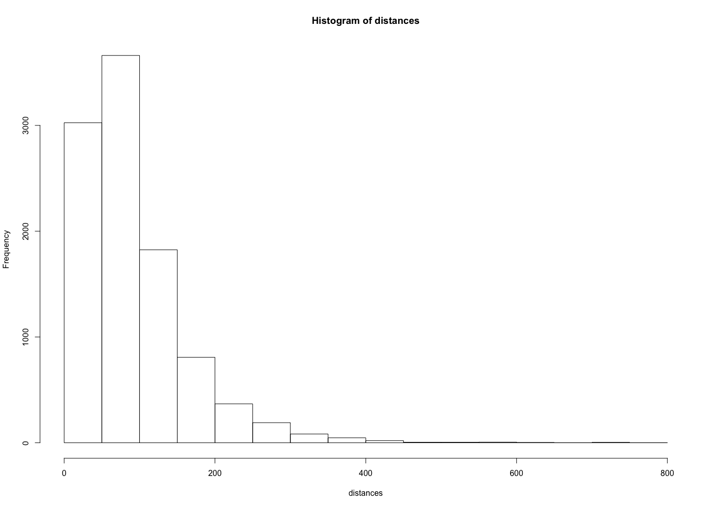
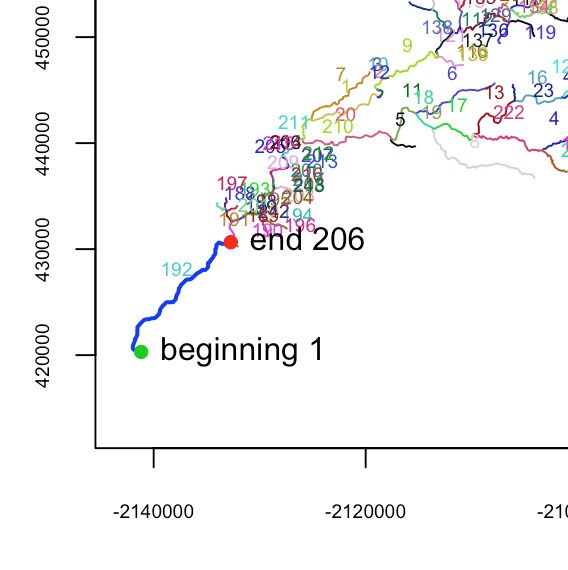

```{r setup, include=FALSE}
knitr::opts_chunk$set(echo = TRUE, warning=FALSE, message=FALSE)
knitr::opts_knit$set(root.dir = normalizePath("../"))

```

# Part III: Snapping Points to NHD Flowline Data and Calculating River Distance with `riverdist`

  Though it's a bit late in getting posted, this is part III in a spatial series that is becoming a quasi-workshop in the variety of ways we can work with spatial river & stream data in R. This post will continue using the `sf` package, and introduce the `riverdist` package, but we'll still be playing with data on rivers and streams. 
  
  To recap, in the first few posts we made a leaflet map, scraped data from tables on a webpage, demonstrated how to calculate distance matrices between point data, and showed how to use functions written by folks at USGS (OWI) as well as the Hydrosheds data to download riverline data. That's a fair amount to chew on I realize, but I'd like to demo a few additional things that might be useful for folks working with river data. 
  
**This post will (*try to*) show you:**
  
 - How to use the `riverdist` package to process a riverline network
 - How to snap spatial point data to the processed riverline data (which we downloaded in the previous post)
 - Finally, how to calculate the river distance between sites (so along the river network)
 - and a quick `ggmap` example
 
I think in a future post I'd like to demo how to implement a wavelet analysis of these flow data, as well as show an example of the very cool [`geoknife`](http://usgs-r.github.io/geoknife/) package to assess patterns of river impairment. Onward!

So, hopefully these posts are useful and it doesn't feel like this:


### Load the Packages

The main packages I'm going to use in this post:

```{r packages, eval=T, echo=T}

# load libraries
suppressMessages({
  library(dplyr); # data munging and piping
  library(purrr); # for list functions
  library(ggplot2); # plotting
  library(ggrepel) # for labeling
  library(sf); # spatial simple features
  library(USAboundaries); # state/county data
  library(Imap); # nice mapping/color functions
  #library(geoknife); # USGS tool set (Next post)
  #library(dataRetrieval); # USGS tool set (next post)
  #library(httr) # scraping webdata (to download flowlines)
})

# Note, to plot `sf` objects with `ggplot`, you need to have the most recent version (>2.2.1). A quick and easy check you can add to your code is an `if` statement: `if (utils::packageVersion("ggplot2") > "2.2.1"))`
```

# Calculating River Distances

To use the `riverdist` package, we need to load a shapefile with a river network of some type. This example uses NHD Streamline data, cropped to the North Fork American watershed. I downloaded the flowline data for the North Fork American watershed using the `get_flowline` function from our previous post, at Stream Order 1, 2, 3, and 4. The function was from an excellent gist by Laura DeCicco (see [here](https://gist.github.com/ldecicco-USGS/56262f3809f0807cb523d7105cb790a9)), and I modified it slightly to work with the `sf` package. 

To save time, I've put these data on github [here](https://github.com/ryanpeek/ryanpeek.github.io/blob/master/data/nhd_rivs_nfa_ord_1_4.rda) for download. Let's use [HUC8 data](https://github.com/ryanpeek/test_projects/blob/master/data/shps/h8_AMR_BEA_YUB.zip) from the previous post as well. Download it to a "`data`" folder and the code below should work.

## Load Flowline & HUC Data

Let's take a look at the Streamline data for `Stream Order=2`. Note the river network was downloaded using a bounding box or extent (max and min lat and lon values for a given shapefile), so it extends outside of the specific HUC8 watershed boundary we're interested in.

```{r loadHUCflowdata, echo=T, eval=T}

# load the streamline data
load("data/nhd_rivs_ord_1_4.rda")

# load the hucs
huc8 <- read_sf(unzip("data/h8_AMR_BEA_YUB.zip"), quiet = F) %>%
  st_transform(crs=4326) #%>% 

# warning message here is ok!

# then remove raw files since file is added in memory
file.remove(list.files(pattern = "h8_AMR_BEA_YUB*",recursive = F))

# filter to the NF American only
h8 <- huc8 %>% filter(HU_8_NAME=="North Fork American") 

# plot 
plot(st_geometry(h8), axes=F, lwd = 3)
plot(st_geometry(rivers2), col="blue", add=T)
title(main = "NF American Watershed & NHD Flowline (Stream order=2)", family="Roboto Condensed")

```

### Crop and Save as Shapefile

In order to use the `riverdist` package, we are going to want to trim our flowline data to a single watershed, and get rid of the streams outside of that boundary. Let's crop the flowline data to the NF American Watershed using `sf::st_intersection`. Then we can write the data as a shapefile.

```{r cropAndSave}

# crop river data by huc8 data with sf function
rivs2 <- st_intersection(rivers2, h8)

# plot to check:
plot(st_geometry(h8), axes=F, lwd=3)
plot(st_geometry(rivs2), col="blue", add=T)
title(main = "NF American Watershed & NHD Flowline (Stream order=2)", family="Roboto Condensed")

# okay looks good lets save:
st_write(rivs2, "data/nfa_rivers2.shp", delete_dsn = T) 

# "delete_dsn=T" will allow you to overwrite existing file so you don't get an error like this:
### Error in CPL_write_ogr(obj, dsn, layer, driver, as.character(dataset_options),  : 
###  Dataset already exists.

```

You might see a warning message about attribute field names, that's okay, it's just making field names unique. The file should be where you saved it, and have 4 separate files (`.dbf`, `.prj`, `.shp`, `.shx`). There can be more associated with a shapefile, but these 4 are the core set that are required.

# Clean River Network Topology

Now that we have a river network, we need to clean it and check for errors so that when `riverdist` is routing things along the network, distances will be accurate.

**The main steps are:**

 - Load data and transform into a projected coordinate system
 - Plot and Check Topology
 - Clean the network topology so we can snap points, save data
 - Calculate distances along the river network between sites

## Load Data and Project

First we need to load the package and project our data. `riverdist` won't work unless data are in a projected coordinate system. If you aren't sure what the difference between projected (PCS) and geographic coordinate systems (GCS) are, here's the quickest summary I can provide.

 - **GCS** are based on a spherical earth model (3-dimensional), so use coordinates like latitude & longitude (a datum) in a 3-dimensional space to define locations based on a spheroid model (of which there are several). The datum is used to link the spheroid model to the earth's surface.
 - **PCS** project locations onto a 2-dimensional Cartesian coordinate plane. That's why we refer to these as *map projections*. Different projections have different ways of stretching the 3-d earth's surface onto a flat 2-d plane. But by putting things onto a flat 2-d surface, calculations (like calculating distances along a river network) are usually easier to do.

```{r rivernetwork, echo=T, eval=T}

# load the package
library(riverdist)

# riverdist only works w/ projected coordinate systems...a few options:
## EPSG:102003 USA_Contiguous_Albers_Equal_Area_Conic
## +proj=aea +lat_1=29.5 +lat_2=45.5 +lat_0=37.5 +lon_0=-96 +x_0=0 +y_0=0 +datum=NAD83 +units=m +no_defs
## EPSG:102004 USA_Contiguous_Lambert_Conformal_Conic
## EPSG:102005 USA_Contiguous_Equidistant_Conic

# read in the network and project with Albers Equal Area
rivs <- line2network(path="data/", layer="nfa_rivers2", reproject = "+proj=aea +lat_1=29.5 +lat_2=45.5 +lat_0=37.5 +lon_0=-96 +x_0=0 +y_0=0 +datum=NAD83 +units=m +no_defs")

# should see message about "Removed 36 Segments w short lengths"

# plot of all the segments
plot(x=rivs)
```

## Plot and Check Topology

Ok, so we should see a whole bunch of rainbow colored numbered segments. If we want to look at topology, we can plot the nodes (confluences). Green dots represent connections or confluences between segments, red dots are "headwaters" or isolated branches. Notice there are some red dots in some odd locations.

```{r topologyNodes, echo=T, eval=T}

# check topology (nodes)
topologydots(rivers=rivs)

```

## Cleanup: Insert Vertices and Identify River Mouth

The [`riverdist`](https://cran.r-project.org/web/packages/riverdist/vignettes/riverdist_vignette.html) tutorial/vignette is pretty good and will walk folks through the main steps. For larger river networks and the finer scale data you have, the more likely you can end up with weird and even persistent things you need to clean (stream braiding, unconnected segments, etc). Be aware this cleaning of topology is a stepwise process and it can take some time, but once you have everything cleaned up, you can save the data and re-use network in the future.

I'll try to screen shot this process below. First let's run the `cleanup()` function.

```{r riverdist_cleanup, eval=F, echo=T}

# do a clean up:
rivs_fixed <- cleanup(rivers = rivs)

```

Initially the cleanup will identify all the segments and attempt to remove duplicate lines and dissolve segments that are split (uncessarily). When it asks whether to **`Dissolve`** or not, select **yes**.

```
Dissolving... 
Simplified from 615 to 243 segments. 

 Checking for segments with length less than the connectivity tolerance... 

 0 microsegments identified. 

 Checking if splitting segments is needed... 
Checking between-vertex lengths... 
Maximum distance between vertices is 772 
Insert vertices to reduce distances between vertices and increase point snapping precision? (y/n) ?
```

The `Insert vertices` question makes a more evenly distributed network so when we try snap points, there will be more vertices available in the network. The histogram provides a sense of the distribution of the segement sizes. I try to select something near the peak so most segments are a consistent size. 



Select "**`y`**", and pick a number...I picked 100 meters for this example. The output will then say it's inserting vertices, followed by:

`Please identify segment number of river mouth:`



Here I've selected **segment 192**, and then selected the mouth as *1*. Once the river mouth has been identified, the program will ask if you want to remove any additional segments. I select **n** here, but many options.

### Cleanup: Remove Additional Segments/Braiding

The cleanup function will then continue and ask if you want to remove additional segments, and check for braiding. Just walk through and determine what you want to keep or not. If there are braided segment, you'll need to pick out the components you want to keep and which to delete. This can be a bit tedious (especially with very fine-scale datasets), but once you walk through, you'll be able to save your updated network. Here I remove as many of the braided segments as I can (`207, 213, 205, 204, 214, 138, 10, 11, 232, 230`).

Once done with removing braided segments, `riverdist` will ask if you want to build segment routes. I select **y** here.

## Save the Cleaned Data

According to `riverdist`, we should save our cleaned topology file as a `Rdata` file. Let's save our file.

```{r save_fixed_topology, echo=T, eval=F}

save(rivs_fixed, file = "data/nfa_rivs2_fixed.rda")

```

## Plot Cleaned Topology

Let's take a look at what we did, and why it matters, by plotting the original river network topology vs. the cleaned version.

```{r compare_fixed_topology, echo=T, eval=T}

load("data/nfa_rivs2_fixed.rda")

# now plot the old vs. the new
par(mfrow=c(1,2))
topologydots(rivers=rivs)
graphics::title("Raw River Topology", family="Roboto Condensed")
topologydots(rivs_fixed)
graphics::title("Clean River Topology", family="Roboto Condensed")

```

We can see that the *Clean* river topology has fewer nodes and is a cleaner network, which means it will be more accurate and faster for calculating network distances.

```{r eval=T, echo=F}
dev.off()
```

# Snapping Points to Lines

Now that we have a river network, we can snap points to the nearest line, and use that to calculate distances between sites along the river network. First let's grab some points! For this example let's go back and grab all CDEC stations from the NF American watershed. To do that I searched for any/all stations in the American River basin using [this interface](https://cdec.water.ca.gov/cgi-progs/staSearch). The resulting page I ended up with was [**this**](https://cdec.water.ca.gov/cgi-progs/staSearch?sta=&sensor=211&dur=&active=&lon1=&lon2=&lat1=&lat2=&elev1=-5&elev2=99000&nearby=&basin_chk=on&basin=AMERICAN+R&hydro=CENTRAL+COAST&county=ALAMEDA&operator=%2B&display=sta). Then I used the web-scraping technique I showed in the [first post in this series](https://ryanpeek.github.io/2017-10-24-mapping-with-sf-part-1/)) to pull that data in.

## Get Point Data (for Snapping)

```{r getNFA_CDECstations, eval=T, echo=T}

library(rvest)

url <- "https://cdec.water.ca.gov/cgi-progs/staSearch?sta=&sensor=211&dur=&active=&lon1=&lon2=&lat1=&lat2=&elev1=-5&elev2=99000&nearby=&basin_chk=on&basin=AMERICAN+R&hydro=CENTRAL+COAST&county=ALAMEDA&operator=%2B&display=sta"

df <- url %>%
  read_html() %>% 
  html_nodes(xpath='//*[@id="main_content"]/div/div[1]/table') %>% # inspect and xpath with chrome
  html_table()
df_locs <- df[[1]] # reads in as a list, so we are just eliminating the list and making this a dataframe

head(df_locs)
dim(df_locs)

# cleanup data
df_locs <- df_locs %>% rename(station="Station Name", river_basin="River Basin", 
                              lon=Longitude, lat=Latitude, elev_ft=`Elevation Feet`) %>%
  select(-Map)

# remove and filter out the weird UNIX code "&nbsp"
df_locs$elev_ft <- as.numeric(gsub(pattern = "&nbsp", replacement = "", df_locs$elev_ft)) 

# make CDEC data sf object (spatial): 
df_locs <- st_as_sf(df_locs, 
                    coords = c("lon", "lat"), # for point data
                    remove = F, # don't remove these lat/lon cols from df
                    crs = 4326) # add projection (this is WGS84)
```

 

Sweet it works!  We have 136 stations in the American watershed...let's crop down to only the points that occur within our HUC8 watershed. First let's check that there aren't NA's or weird locations in this set...so PLOT the data.

## Plot Point Data

```{r plot_xyData, eval=T, echo=T}

# PLOT data
plot(st_geometry(h8), lwd=2)
plot(st_geometry(rivs2), col="blue", add=T)
plot(st_geometry(df_locs), add=T, pch=16, col = "maroon")
graphics::title("All CDEC Stations in American Watershed", family="Roboto Condensed")

```

Ok, some outside of the watershed boundary. Let's crop with `st_intersection` again.

```{r crop_xyData, eval=T, echo=T}
# let's crop points to only those within the watershed:
df_locs_NFA <- st_intersection(df_locs, h8)

# plot
plot(st_geometry(h8), lwd=2, axes=F)
plot(st_geometry(rivs2), col="blue", add=T)
plot(st_geometry(df_locs_NFA), add=T, pch=21, bg = "orange", cex = 1.5)
graphics::title("Selected CDEC Stations in NF American Watershed", family="Roboto Condensed")

```

Great, now we have 44 points within the watershed we can work with. Even better, you can see some do not appear to be on a flowline. The next steps will show how to snap these points to the flowline network.

## Snap Points to Nearest FlowLine

Finally we can now snap our points to the river network! We need to project our data, so that it will line up with our cleaned river topology, add those projected X/Y data (in UTM), and then snap to our network.

```{r snap_xyData, eval=T, echo=T}

df_locs_NFA <- df_locs_NFA %>% 
  st_transform(crs = 102003) # convert to Albers Equal Area

# add COORDS in projected form (UTM)
df_locs_NFA$X <- st_coordinates(df_locs_NFA)[,1]
df_locs_NFA$Y <- st_coordinates(df_locs_NFA)[,2]

# run this to snap points to line (and see distrib)
cdec_riv <- xy2segvert(x=df_locs_NFA$X, y=df_locs_NFA$Y, rivers=rivs_fixed)
head(cdec_riv)
hist(cdec_riv$snapdist, breaks=50,main="Point Snapping distance (CDEC to Flowline)", col="skyblue3", xlab="Snapping Distance (m)", family="Roboto Condensed")

# add vertices
df_locs_NFA <- bind_cols(df_locs_NFA, cdec_riv)

# MAP IT
plot(x=rivs_fixed, color = FALSE)
points(df_locs_NFA$X, df_locs_NFA$Y, pch=16, col="red") # raw coords
riverpoints(seg=cdec_riv$seg, vert=cdec_riv$vert, rivers=rivs_fixed, pch=22, cex=1.5,
            bg="forestgreen") # snapped coords
text(df_locs_NFA$X, df_locs_NFA$Y, labels=df_locs_NFA$vert, pos = 4, family="Roboto Condensed")
```

Great, now we have a set of points that represent CDEC station locations, snapped to the nearest NHD river segment.

### Detect Routes

If we want to calculate the distance between two points and identify the route, we can use `detectroute`. Just pick two segment numbers, and then it will return the steps required for the route.

```{r detectroute}

# DETECT ROUTES
detectroute(start=189, end=6, rivers=rivs_fixed)

# then use that information to pick the starting/end segments, and the vertices of interest.
riverdistance(startseg=189, startvert=185, endseg=6, endvert=1,
               rivers=rivs_fixed, map=TRUE)

```

So the total distance between `LOOMIS OBSERVATORY` (Station `LMO`) and `DEADMAN FLAT` (Station `DNF`) is 41.7 km along this river network. 

### Create Distance Matrix

Once points are snapped to the line network, it is possible to extract distances between site pairs, and export. We create a matrix of distances, and then plot a heatmap below.

```{r create_dist_matrix, eval=T, echo=T}

# CREATE MATRIX OF DISTS
dmat <- riverdistancemat(df_locs_NFA$seg, df_locs_NFA$vert, rivs_fixed, ID = df_locs_NFA$Locality ) %>% as.matrix
dmat <- dmat/1000 # convert to km
head(dmat)

# library for heatmap
library(fields)

image.plot(1:nrow(dmat), 1:ncol(dmat), dmat, axes = FALSE, 
      xlab="", ylab="", col = terrain.colors(50))
axis(1, 1:nrow(dmat), rownames(dmat), cex.axis = 0.7, las=3, family="Roboto Condensed")
axis(2, 1:nrow(dmat), colnames(dmat), cex.axis = 0.5, las=1, family="Roboto Condensed")

# this add exact value to each grid square:
#text(expand.grid(1:nrow(dmat), 1:ncol(dmat)), sprintf("%0.1f", dmat/1000), cex=0.6, family="Roboto Condensed")
graphics::title("River Distance Matrix (km) for CDEC Stations in NF American Watershed", cex.main=1, family="Roboto Condensed")

# write the data out
nfa_dists <- as.data.frame(dmat)
# write_tsv(nfa_dists, "data_output/mainstem_distance_matrix_NFA.txt")
```

## Make a ggMap

Finally, we can map these data with a terrain or google map background. Just another alternative to some of the other options shown thus far.

```{r simple_ggmap, echo=T, eval=T}

# SIMPLE MAP --------------------------------------------------------------

library(ggmap) # doesn't plot with SF so need to convert
location<-c(mean(st_coordinates(h8)[,1]),
            mean(st_coordinates(h8)[,2]))
map1 <- get_map(location=location,crop = F,
                color="bw",
                maptype="terrain",
                source="google",
                zoom=9)

terrain_bg <-ggmap(map1)

# convert to GCS (WGS84)
df_locs_NFA <-df_locs_NFA %>% st_transform(crs = 4326)

# convert river network:
rivs_nfa <- st_read("data/nfa_rivers2.shp", quiet = T) %>% st_transform(crs=4326) %>% 
  as("Spatial") %>% fortify

# convert h8_nfa
h8_nfa.sp <- h8 %>% as("Spatial") %>% fortify

terrain_bg + 
  scale_color_viridis_d() +
  geom_path(data=rivs_nfa, aes(x=long, y=lat, group=group), col="blue")+
  labs(x="Longitude (WGS84)", y="Latitude") +   theme_bw() +
  geom_polygon(data=h8_nfa.sp, aes(x=long, y=lat, group=group), fill=NA, color="maroon", lwd=1.2, alpha=0.5) +
  geom_point(data=df_locs_NFA, aes(x=lon, y=lat), fill="yellow", pch=21, size=3) +
  coord_fixed(ratio=1.3) +
  ggtitle("CDEC Stations in the NF American Watershed, Snapped to NHD Flowline")

```

# Summary

Thanks for making it to the end! If you are reading, sorry that was long, but hopefully it was interesting. There are lots of pieces that can be switched out, and you can imagine being able to snap survey sites, observations, etc. to a flowline network and calculating distances between these points. For some of my work, this is really useful for generating distance matrices that can be compared against population genomic data, when measuring metrics like F~ST~ (isolation).

All for now! Stay tuned for another post in a few weeks.
