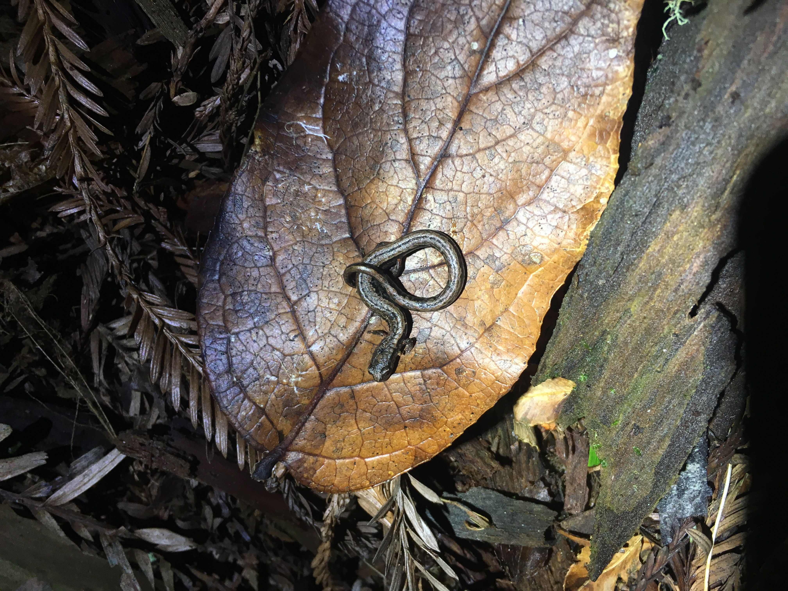
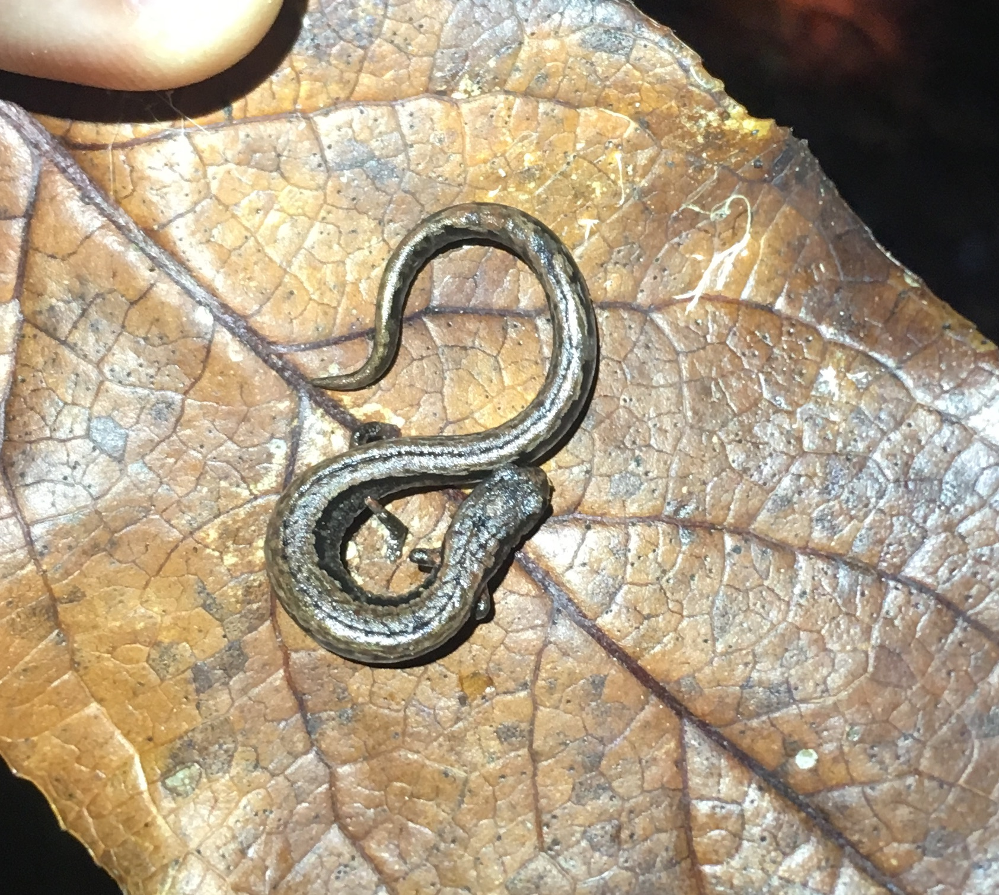
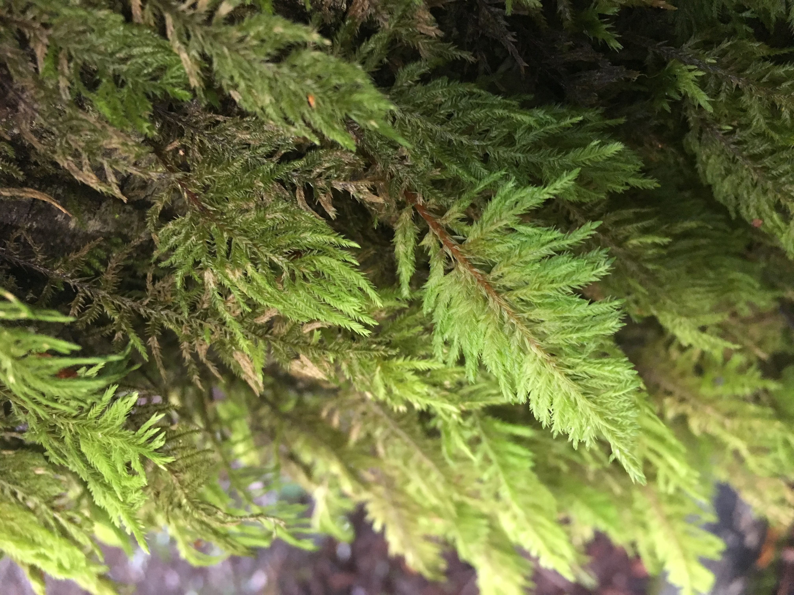
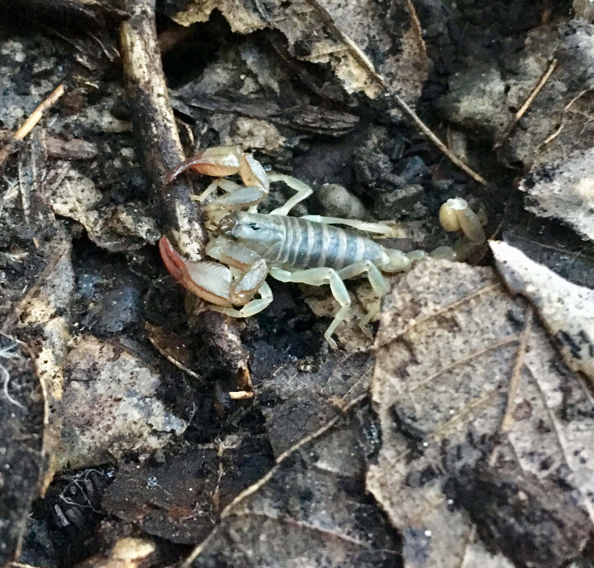
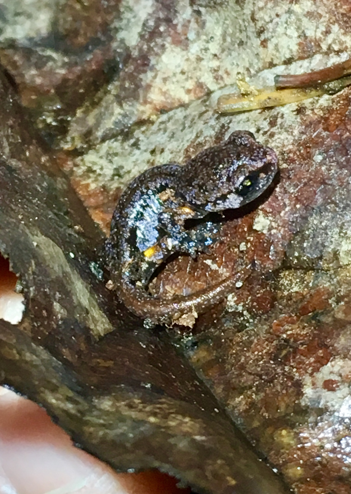
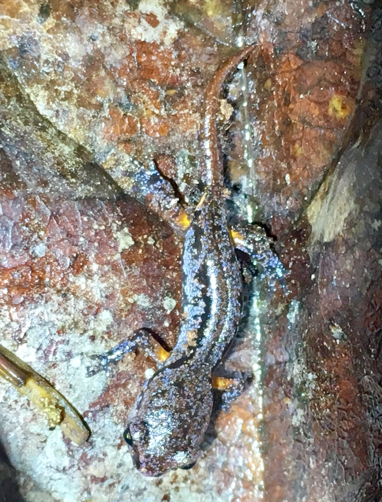
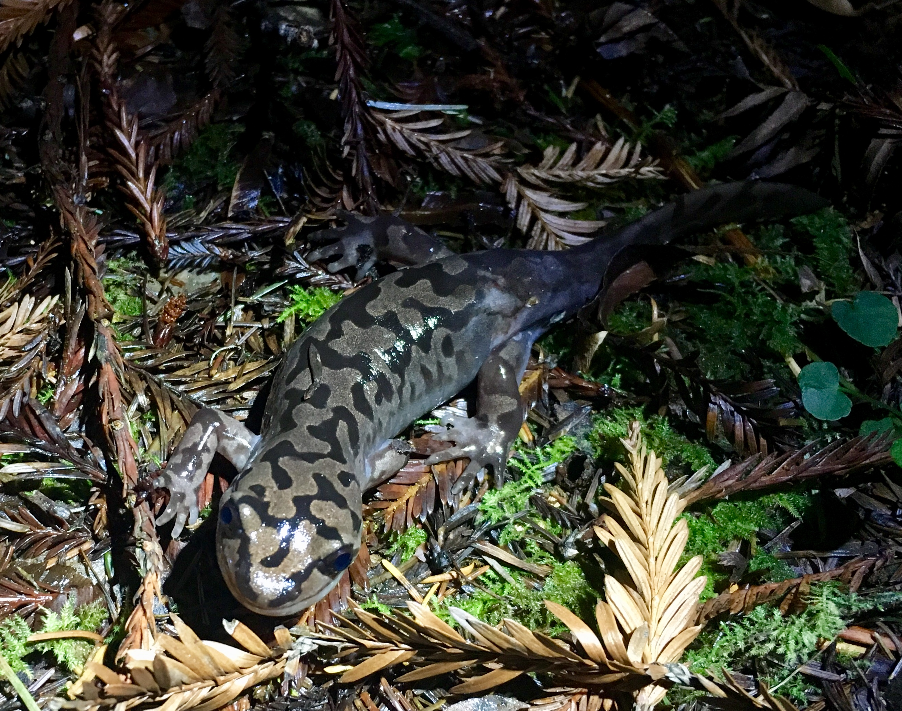

```{r setup, include=FALSE}
knitr::opts_chunk$set(echo = TRUE, warning=FALSE, message=FALSE)
knitr::opts_knit$set(root.dir = normalizePath("../"))

```

# Updated *Mapping in R* Webpage (and Salamanders)

I've been meaning to update my **Mapping in R** webpage, which I put together about a year ago. Amazing how much changes in 9 months in the #rstats world. I finally got around to cleaning a few things up and hopefully this new version helps revamp and revise the bits that needed cleaning. It provides some revised code that should work based on new changes to Google Maps (requiring an API, which makes using packages like [`ggmap`](https://github.com/dkahle/ggmap) a little trickier) and adds functionality of new packages like [`ggspatial`](https://cran.r-project.org/web/packages/ggspatial/vignettes/ggspatial.html), which make adding scale bars and north arrows infinitely easier in `ggplot2`.

  So the new webpage has much of the same content but has been updated (hopefully for another year or so). Feel free to ping me if you have questions or if code isn't working. In the meantime, please check it out!
  
###  [ryanpeek.github.io/mapping-in-R-workshop](https://ryanpeek.github.io/mapping-in-R-workshop/)
  
Also,  here are a few fun photos of California salamanders from a recent Northern California adventure. I was up in Arcata for a conference ([APTF](http://www.canvamphibs.com/)), and spent some time poking around for salamanders and other fun critters.

```{r, out.width = "75%", echo=FALSE}
library(knitr)

```
 > Slender Salamander (*Batrachoseps attenuatus*)

```{r, out.width = "75%", echo=FALSE}



```
 > Another Slender Salamander (*Batrachoseps attenuatus*)


```{r, out.width = "45%", echo=FALSE}



```

 > Moss in Eel Watershed

```{r, out.width = "65%", echo=FALSE}



```

 > California Common Scorpion

```{r, out.width = "65%", echo=FALSE, }



```

 > *Ensatina* spp.


```{r, out.width = "65%", echo=FALSE}



```

> *Ensatina* spp.

```{r, out.width = "65%", echo=FALSE}



```

 > Coastal Giant Salamander (*Dicamptodon tenebrosus*)