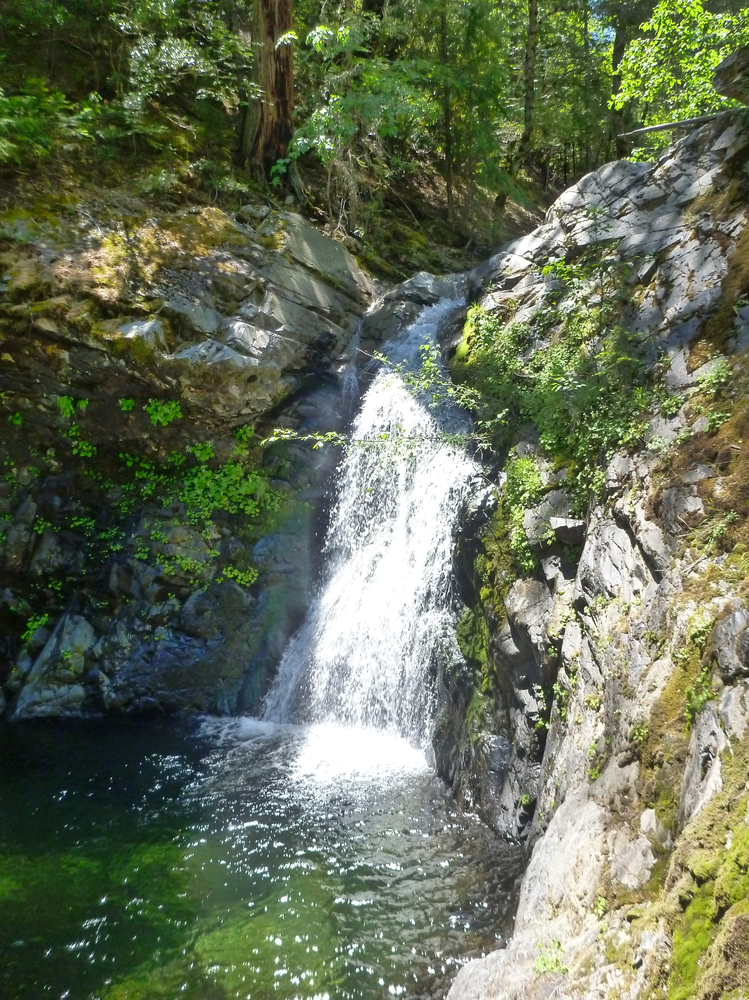
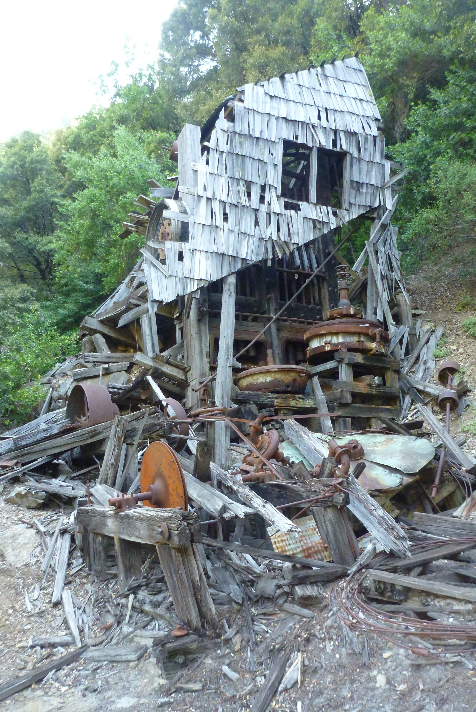

## Field Visit to Sailor Canyon

As part of my dissertation, I have been visiting many streams and creeks throughout the Sierra Nevada to search for foothill yellow-legged frogs (*Rana boylii*). One of the goals is to better understand not only the current range of the species, but also to use genetics as a tool to assess how populations have changed within and because of the landscape they inhabit. What does that mean in plain language? Well, to start we don't know what the elevational limit is for the species...most experts in the field would say populations are primarily found below 5,000 feet, with most found below 4,000 feet. However Stebbins (2005 guide) shows records recorded over 6,000 feet. So I've been searching canyons and creeks in the American watershed to get a better sense of the elevation range for this species. [^1] 

A second goal in my disseration is to see if we can use populations genetics of this frog species to tell us about the intensity and history of landscape alteration. Often called historical demography, it's the ability to look back in time and see how a population has changed (genetically) through time. With genetic data, we can assess different versions or models of these landscapes and see which one best explains our data. Basically we can see how frog populations grew or declined through time, and how changes in the landscape might explain those changes.

What is really interesting is the history of the landscapes these critters inhabit. These frogs are tightly tied to moving water in creeks and rivers, and really don't move far from the water, so they make an interesting metric of watershed change.  In the Sierra Nevada and in the American watershed in particular, gold mining completely transformed the riverscapes. In only five or six decades, many river basins which took thousands of years to form, were drastically and in some cases permanently altered. These alterations were largely driven by hydraulic mining, where entire hillsides were washed away with giant water cannons (called monitors), but many areas were mined in different ways and at different intensities. Because water was required for the cannons used in "hydraulicking", elaborate canal and ditch systems were built to support these large mining operations. In the NF American River, it appears hydraulic mining occurred as far as Green Valley and into Humbug Canyon, but was limited and largely non-existent upstream of that point. There were still many gold mines upstream of this point, but they were not hydraulic type operations. 

### Sailor Canyon

The site I visited recently, Sailor Canyon, was the site of a large gold mine, La Trinidad, but this canyon is well above the hydraulicking zone. There's still a 10-stamp mill (see picture below) in somewhat dilapidated form, on the hike down. Very cool, though take care hiking around the wreckage. The trail down is very steep, with little reprieve from the steep gradient devoid of switchbacks. It is simply straight down. To find the trailhead was a little bit tricky since all signs have been knocked down or worse, redirected (the hiking trail sign was pointing the wrong direction). Nonetheless, it's a really great hike through some beautiful country. [^2]

Even more amazing, I found frogs in the canyon! Not in great numbers, but there is a breeding population in Sailor Canyon, and there appears to be frogs throughout the mainstem NF American downstream of Sailor Canyon as well. I'm excited to see what story genetics can tell us about these frogs, especially because they are in a very interesting geologic and anthropogenic zone in the NFA.

### Map Details

I made this in R, using a script to convert the gpx file from my GPS, and then plot it, as well as add a few layers for easier navigation. Let me know if you have questions or comments!

<!--html_preserve-->

<!--/html_preserve-->

#### Script:


library(leaflet); library(rgdal); library(dplyr)
# Projection  
WGS84 <- "+proj=longlat +ellps=WGS84 +datum=WGS84"  
# read in GPX  
t1 <- readOGR("data/2016-06-28-NFA-Sailor.GPX", layer="tracks")  
p1 <- readOGR("data/2016-06-28-NFA-Sailor_points.GPX", layer="waypoints")  
# transform
p1<-spTransform(p1, CRS(WGS84))
t1<-spTransform(t1, CRS(WGS84))
# make a map!
m <- leaflet() %>% addTiles() #this is shortened
setView(lng = -120.49312, lat = 39.209, zoom = 10) %>%  # set to Auburn/Colfax, zoom 5 for CA 
  addTiles(group = "OSM") %>%
  addProviderTiles("Stamen.TopOSMFeatures", group = "OSM Features") %>%
  addProviderTiles("Esri.WorldImagery", group = "ESRI Aerial") %>%
  addProviderTiles("Thunderforest.Landscape", group = "Topo") %>%
  hideGroup("OSM Features") %>% 
# PhD samples
  addCircleMarkers(data=p1, group="Rana boylii",
                   popup = paste0("Name: ", 
                                  p1@data$name, " ","Description: ",
                                  p1@data$desc),
                   stroke=TRUE, weight=0.6,radius=11,
                   fillOpacity = 0.8, color="black",
                   fillColor = "yellow") %>%
  # Sailor Canyon hike
  addPolylines(data=t1, group="Sailor Trail",
               popup = paste0("Name: ", t1@data$name),
               stroke=TRUE, weight=0.6,
               fillOpacity = 0.8, color="maroon") %>%
  # add controls for basemaps and data
  addLayersControl(
    baseGroups = c("OSM", "ESRI Aerial", "Topo"),
    overlayGroups = c("Rana boylii",
                      "Sailor Canyon Trail", "OSM Features"),
    options = layersControlOptions(collapsed = T))
m


[^1]: Who cares how high these frogs occur? It matters because in some locations in the Sierra Nevada a similar (but typically high elevation) species the **Sierra yellow-legged frog** (*Rana sierrae*) may overlap with *R. boylii*. The important difference is that *Rana sierrae* is a federally listed species on the Endangered Species Act, which requires different and stronger management strategies.

[^2]: Nice description of a stamp mill [here](http://www.sierracountygold.com/History/BecomingCA_Archive44.html)
